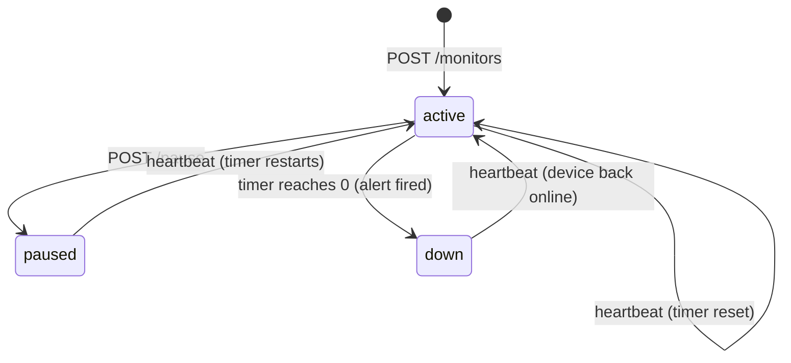
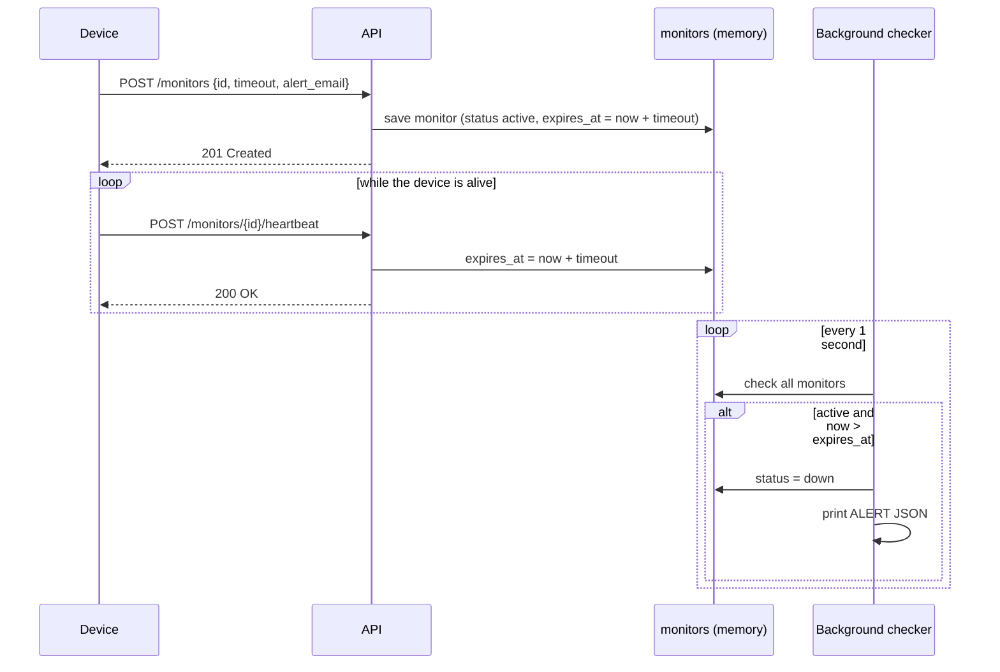

# Diagrams

## State Diagram

```mermaid
stateDiagram-v2
    [*] --> active: POST /monitors
    active --> active: heartbeat (timer reset)
    active --> paused: POST /pause
    paused --> active: heartbeat (timer restarts)
    active --> down: timer reaches 0 (alert fired)
    down --> active: heartbeat (device back online)
```

## Sequence Diagram

```mermaid
sequenceDiagram
    participant D as Device
    participant A as API
    participant S as monitors (memory)
    participant C as Background checker

    D->>A: POST /monitors {id, timeout, alert_email}
    A->>S: save monitor (status active, expires_at = now + timeout)
    A-->>D: 201 Created

    loop while the device is alive
        D->>A: POST /monitors/{id}/heartbeat
        A->>S: expires_at = now + timeout
        A-->>D: 200 OK
    end

    loop every 1 second
        C->>S: check all monitors
        alt active and now > expires_at
            C->>S: status = down
            C->>C: print ALERT JSON
        end
    end
```