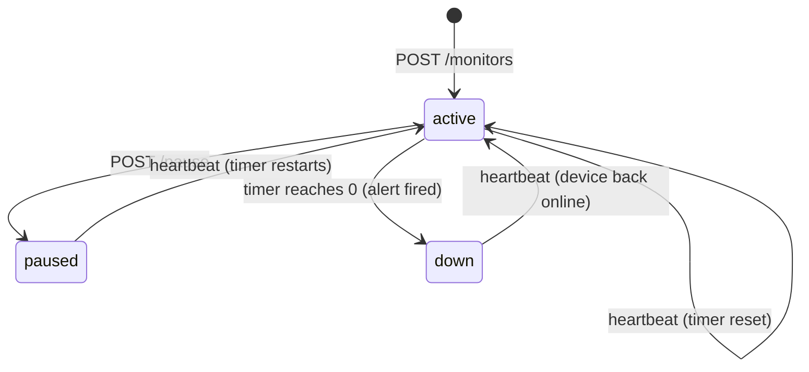

# Diagrams

## State Diagram

```mermaid
stateDiagram-v2
    [*] --> active: POST /monitors
    active --> active: heartbeat (timer reset)
    active --> paused: POST /pause
    paused --> active: heartbeat (timer restarts)
    active --> down: timer reaches 0 (alert fired)
    down --> active: heartbeat (device back online)
```